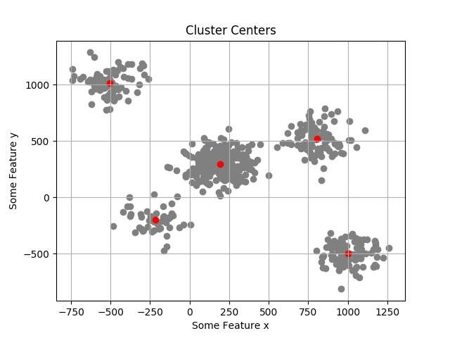
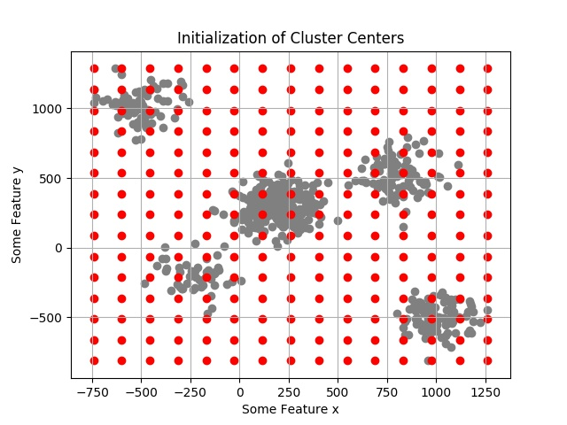
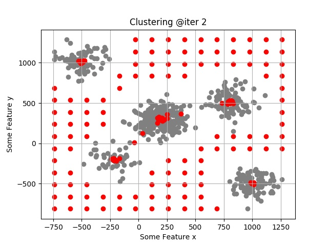
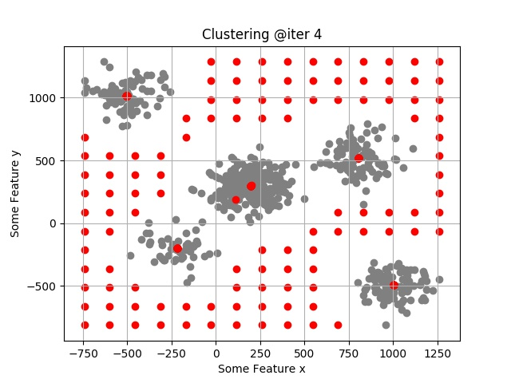
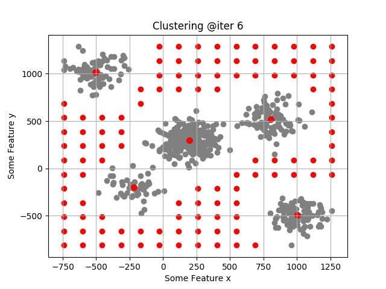
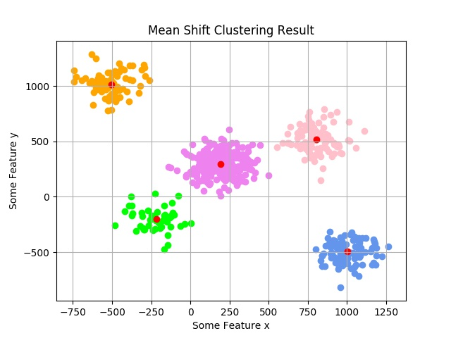

# Clustering Algorithms in Numpy

Implementation of some of the most used Clustering Algorithms from scratch in Python (only using Numpy).

* ## MeanShift Clustering

  ### Generated Data
  

  ### Actual Cluster Centers
  

  ### Predicting Cluster Centers

  * #### Initialization of Predicted Cluster Centers
    

  * #### Predicted Cluster Centers after 2nd Iteration
    

  * #### Predicted Cluster Centers after 4th Iteration
    

  * #### Predicted Cluster Centers after 6th Iteration
    

  ### Final Mean Shift Clustering Result
  

* ## kMeans Clustering

  ### Generated Data
  

  ### Before kMeans
  

  ### Predicting Cluster Centers

  * #### Predicted Cluster Centers after 0th Iteration
    
      
  * #### Predicted Cluster Centers after 4th Iteration
    
  
  * #### Predicted Cluster Centers after 8th Iteration
    
  
  * #### Predicted Cluster Centers after 12th Iteration
    
    
    ### Final kMeans Clustering Result
    
